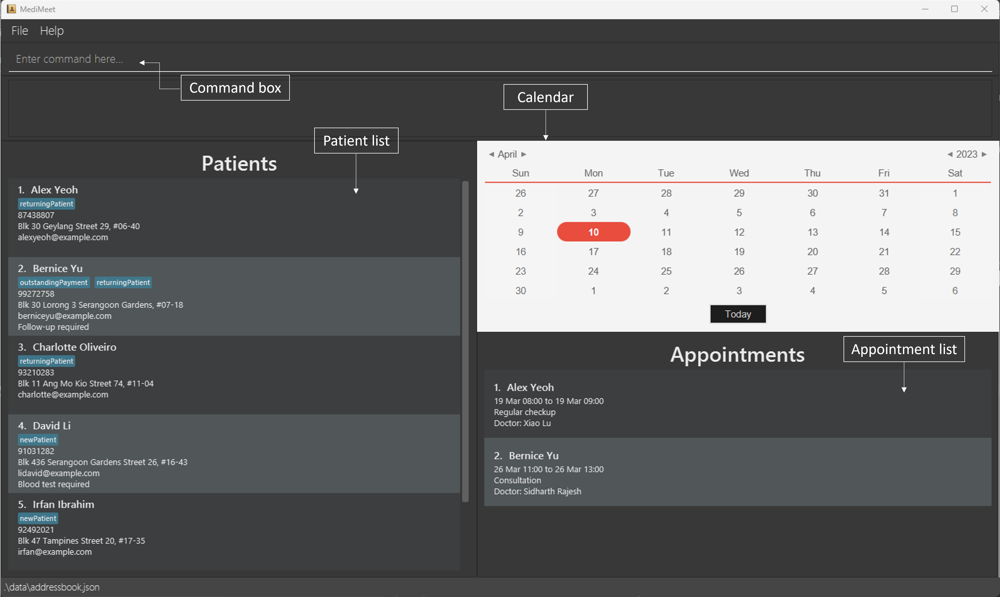
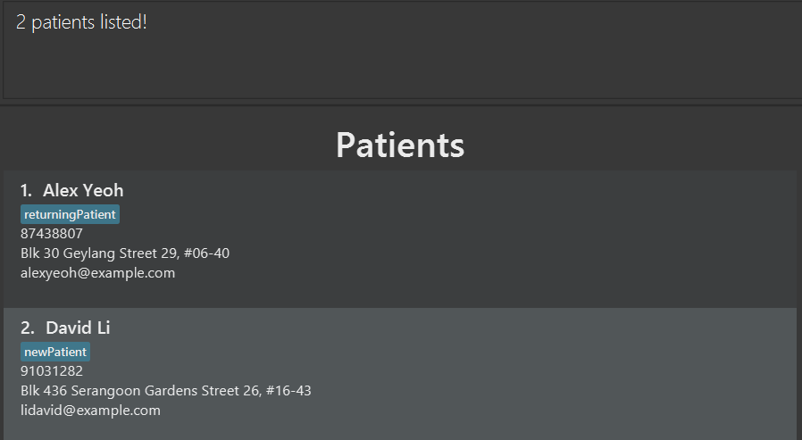
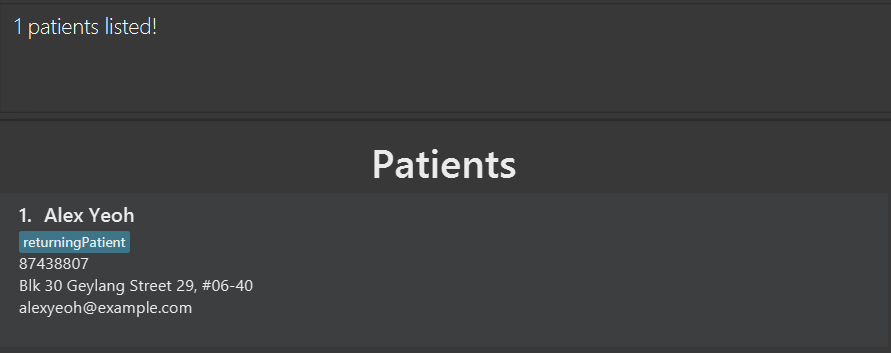
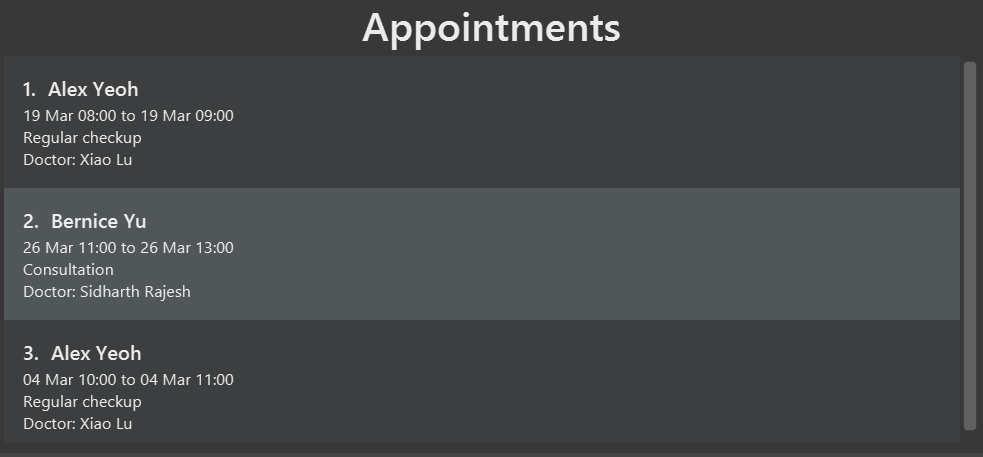
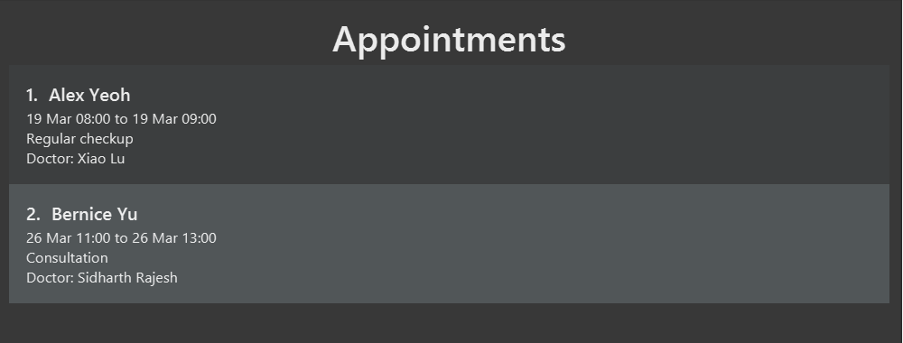

## What is MediMeet?

**MediMeet** is a patient appointment management system for individual medical practitioners and small clinics.
With MediMeet, you can efficiently manage patient and appointment information in one place,
saving you both time and the hassle of maintaining records across multiple systems.  

MediMeet is a command-line interface (CLI) application with fast, easy-to-use commands which make it ideal for the
fast typist.
With MediMeet, we make it easy to add and edit patient information, appointments and so much more, making it
a one-stop solution to manage your individual medical practice or small clinic!  

## Table of Contents

* Table of Contents
{:toc}

--------------------------------------------------------------------------------------------------------------------
## How to (best) use this guide

This user guide is designed to be used by all of first-time, novice and advanced users of MediMeet.
If you are an experienced user, you can jump straight to the [Command summary](#command-summary) section to see a list of all MediMeet’s commands.
The following table shows the different sections and what they contain. To jump to a particular section, click on the link in the table of contents above.

| Section                                                     | Description                                                                |
|-------------------------------------------------------------|----------------------------------------------------------------------------|
| [Quick start](#quick-start)                                 | Contains a step-by-step guide on how to download and start using MediMeet. |
| [Features](#features)                                       | Contains a detailed description of all MediMeet’s functionality.           |
| [FAQ](#faq)                                                 | Contains answers to frequently asked questions.                            |
| [Command summary](#command-summary)                         | Contains a summary of all MediMeet’s commands.                             |
| [Glossary of technical terms](#glossary-of-technical-terms) | Contains descriptions of technical terms used in this guide.               |

--------------------------------------------------------------------------------------------------------------------
Below are some common terms you will come across in the guide, and their explanations.

| Term            | Meaning                                        |
|-----------------|------------------------------------------------|
| **Patient**     | A person who is registered in MediMeet         |
| **Appointment** | A meeting between a doctor and a patient       |
| **Timeslot**    | The time period in which an appointment occurs |
| **Remark**      | A note about a patient                         |
| **Tag**         | A label that can be added to a patient         |
| **MediMeet**    | The application MediMeet                       |

We also use symbols to indicate useful information. The following table shows what each symbol means.

| Symbol               | Description                                                 |
|----------------------|-------------------------------------------------------------|
| :bulb:               | Contains a tip that may be useful when using MediMeet.      |
| :information_source: | Contains important information that you should be aware of. |
| :exclamation:        | Contains a warning that you should take note of.            |

:bulb: **Tip:**
You can use the glossary to quickly look up the meaning of any unfamiliar technical term. Just search for the term you want to look up!

--------------------------------------------------------------------------------------------------------------------
## Quick start

1. Ensure you have Java `11` or above installed in your Computer.
 

 **:information_source: Finding your java version**: To check the default java version on your device, run `java -version` on your terminal. You should see a line of text with `11.x.x`. For more information, refer to [this guide](https://www.java.com/en/download/help/version_manual.html#cmdline).

 

2. Download the latest `medimeet.jar` from [here](https://github.com/AY2223S2-CS2103T-W12-4/tp/releases).

3. Copy the file to the folder you want to use as the _home folder_ for your MediMeet.

4. Open the `medimeet.jar` file by double clicking on it. (On Windows, if a dialog box opens asking 'How do you want to open this file?', choose 'Java(TM) Platform SE binary'.) A window similar to the picture below should appear in a few seconds. Note how the app contains some sample data. 
    * If you are familiar with terminals and command lines, you can choose to open the file from a command line instead. Open a command terminal, `cd` into the folder you put the jar file in, and use the `java -jar medimeet.jar` command to run the application. 
   
    * As you can see from the screenshot of the application, we have four primary parts in the UI. They are:
      * **Command box**: This is where the user types in their commands.
      * **Patient list**: This is the currently shown list of patients with the numbers representing patient index numbers.
      * **Appointment list**: This is the currently shown list of appointments with the numbers representing appointment index numbers.
      * **Calendar**: Shows a calendar view of the current month. When a date is clicked, it will show a popup detailing the appointments for that day.

5. Maximise the app for the best user experience with viewing appointments. If the app is not maximised, some parts of the application may not be shown on your screen.

6. Type the command in the command box and press Enter to execute it. e.g. typing **`help`** and pressing Enter will open the help window. 
   Some example commands you can try:

   * `list_patient` : Lists all patients.
   * `add_patient n/Brenda Song p/98765432 e/brendas@example.com a/Red Road, Blk 123, #01-01` : Adds a patient named `Brenda Song` to MediMeet.
   * `delete_patient 3` : Deletes the 3rd patient shown in the current list.
   * `add_appt n/Brenda Song ts/04032023 10:00,04032023 11:00 d/Regular checkup doc/Xiao Lu` : adds an appointment on `March 4, 2023` from `10:00` to `11:00` hrs for `Brenda Song` with doctor `Xiao Lu` for a `Regular checkup`.
   * `delete_appt 1` deletes the 1st appointment shown in the current list.
   * `exit` : Exits the app.

7. Refer to the [Features](#features) below for details of each command.

--------------------------------------------------------------------------------------------------------------------

## Features

In this section, you will get to learn about the various features of MediMeet.
Before you dive into the features, we would like to give you some pointers about the command format.

**:information_source: Notes about the command format:** 

* Words in `UPPER_CASE` are the parameters to be supplied by the user. 
  e.g. in `add n/NAME`, `NAME` is a parameter which can be used as `add n/John Doe`.

* Items in square brackets are optional. 
  e.g. `n/NAME [t/TAG]` can be used as `n/John Doe t/friend` or as `n/John Doe`.

* Items with `…`​ after them can be used multiple times including zero times. 
  e.g. `[t/TAG]…​` can be used as ` ` (i.e. 0 times), `t/friend`, `t/friend t/family` etc.

* Parameters can be in any order. 
  e.g. if the command specifies `n/NAME p/PHONE_NUMBER`, `p/PHONE_NUMBER n/NAME` is also acceptable.

* If a parameter is expected only once in the command but you specified it multiple times, only the last occurrence of the parameter will be taken. 
  e.g. if you specify `p/12341234 p/56785678`, only `p/56785678` will be taken.

* Extraneous parameters for commands that do not take in parameters (such as `help`, `list`, `exit` and `clear`) will be ignored. 
  e.g. if the command specifies `help 123`, it will be interpreted as `help`.

 :bulb: **Tip:**
Many of the longer commands in MediMeet have a shorter alias. For example, `add_patient` can be used as `ap` instead. Where applicable, the alias will be shown next to the command.

### Adding a patient: `add_patient` or `ap`

Adds a patient to MediMeet.

Format: `add_patient n/NAME p/PHONE_NUMBER e/EMAIL a/ADDRESS [t/TAG]…​`

:bulb: **Tip:**
A patient can have any number of tags (including 0).

:bulb: **Tip:**
MediMeet does not support phone numbers longer than 15 digits. Although MediMeet will still accept phone numbers longer than 15 digits, the application might display the patient list strangely.

:exclamation: **Caution:**
Tags should be limited to 30 characters or less. If you want to record information longer than that, use the `remark` command instead.

Examples:
* `add_patient n/Brenda Song p/98765432 e/brendas@example.com a/Red Road, Blk 123, #01-01`
* `add_patient n/Adam Crowe p/94331843 e/adamc@example.com a/Blue Street, Blk 420, #03-05 t/newPatient`

### Listing all patients : `list_patient` or `lp`

Shows a list of all patients in MediMeet.

Format: `list_patient`

### Editing a patient : `edit_patient`

Edits an existing patient in MediMeet.

Format: `edit_patient INDEX [p/PHONE] [e/EMAIL] [a/ADDRESS] [t/TAG]…​` or `ep`

* Edits the patient at the specified `INDEX`. The index refers to the patient index number shown in the displayed patient list. The index **must be a positive integer** 1, 2, 3, …​
* At least one of the optional fields must be provided.
* Editing of names are not allowed.
* Existing values will be updated to the input values.

:exclamation: **Caution:**
When editing tags, the existing tags of the patient will be removed i.e adding of tags is not cumulative.

* You can remove all the patient’s tags by typing `t/` without
    specifying any tags after it.

Examples:
*  `edit_patient 1 p/91234567 e/johndoe@example.com` Edits the phone number and email address of the 1st patient to be `91234567` and `johndoe@example.com` respectively.

### Locating patients by name: `find_patient` or `fp`

Finds patients whose names contain any of the given keywords.

Format: `find_patient KEYWORD [MORE_KEYWORDS]`

* The search is case-insensitive. e.g `hans` will match `Hans`
* The order of the keywords does not matter. e.g. `Hans Bo` will match `Bo Hans`
* Only the name is searched.
* Only full words will be matched e.g. `Han` will not match `Hans`
* Patients matching at least one keyword will be returned (i.e. `OR` search).
  e.g. `Hans Bo` will return `Hans Gruber`, `Bo Yang`

Examples:
* `find_patient John` returns `john` and `John Doe`
* `find_patient alex david` returns `Alex Yeoh`, `David Li` 
  

### Locating patients by details: `find_patient_details` or `fpd`

Finds patients whose details contain any of the given keywords.

Format: `find_patient_details KEYWORD [MORE_KEYWORDS]`

* The search is case-insensitive. e.g `blk` will match `Blk`
* The order of the keywords does not matter. e.g. `Blk 343` will match `343 Blk`
* All patient details are searched.
* Only full words will be matched e.g. `Bloc` will not match `Block`
* Patient details matching at least one keyword will be returned (i.e. `OR` search).
  e.g. `38 College` will return `38 Avenue Street`, `36 College Avenue East`

Examples:
* `find_patient_details 87438807` returns the patient with a phone number `87438807`

    

### Deleting a patient : `delete_patient` or `dp`

Deletes the specified patient from MediMeet.

Format: `delete_patient INDEX`

* Deletes the patient at the specified `INDEX`.
* The index refers to the index number shown in the displayed patient list.
* The index **must be a positive integer** 1, 2, 3, …​

Examples:
* `list_patient` followed by `delete_patient 2` deletes the 2nd patient in the MediMeet.
* `find_patient Alex` followed by `delete_patient 1` deletes the 1st patient in the results of the `find_patient` command.

### Adding patient notes: `remark_patient` or `rp`

Adds a note to a patient in MediMeet so that the doctor can store and access notes
about a given patient.

Format: `remark_patient INDEX [r/REMARK]`

* Remarks cannot be edited and can only be overwritten.
* In order to remove notes from a patient, use `remark_patient INDEX` without the optional `[r\REMARK]`, or use `remark_patient INDEX r/`.

Example:
* `remark_patient 4 r/Blood test required` Adds a note `Blood test required` to the patient.
  
* `remark_patient 4` Removes any existing note from the 4th patient in the patient list.

### Viewing a patient: `view`

Views a patient's full details in another popup window.

Format: `view INDEX`

Example:
* `view 4`

### Adding an appointment: `add_appt` or `ap`

Adds an appointment for an existing patient in MediMeet.

Format: `add_appt n/NAME ts/TIMESLOT d/DESCRIPTION doc/DOCTOR…​`

* The `TIMESLOT` format is: `DDMMYYYY HH:MM,DDMMYYYY HH:MM` where the first slot indicates the start time and the second slot indicates the end time.
  * Example: `ts/04032023 10:00,04032023 11:00` indicates that the appointment starts at `10:00` hrs on `March 4, 2023` and ends at `11:00` hrs on `March 4, 2023`.

Example:
*  `add_appt n/Alex Yeoh ts/04032023 10:00,04032023 11:00 d/Regular checkup doc/Xiao Lu` : adds an appointment on `March 4, 2023` from `10:00` to `11:00` hrs for `Alex Yeoh` with doctor `Xiao Lu` for a `Regular checkup`.

    

### Listing all appointments : `list_appt` or `la`

Shows a list of all appointments in MediMeet, which is helpful for adding, deleting or editing appointments.

Format: `list_appt`

### Editing an appointment : `edit_appt` or `ea`

Edits an existing appointment in MediMeet.

Format: `edit_appt INDEX [ts/TIMESLOT] [d/DESCRIPTION] [doc/DOCTOR]`

* Edits the appointment at the specified `INDEX`. The index refers to the appointment index number shown in the displayed appointment list. The index **must be a positive integer** 1, 2, 3, …​
* At least one of the optional fields must be provided.
* Existing values will be updated to the input values.
* Fields not edited will remain intact.
* The name of the patient in the appointment cannot be edited.

Examples:
*  `edit_appt 1 ts/01012023 00:00,01012023 01:00 d/Regular checkup` Edits the timeslot of the 1st appointment to be `01012023 00:00,01012023 01:00` and the description to be `Regular checkup`, respectively.

### Locating appointments: `find_appt` or `fa`

Finds all appointments whose timeslots cover the specified date and time.
If a second timeslot is specified, all appointments that occur within the two date and time periods are found.

Format: `find_appt TIMESLOT [TIMESLOT]`

Examples:
*  `find_appt 04032023 10:00` Finds all appointments during `04032023 10:00`, i.e `March 4, 2023` `10:00` hrs.
   
*  `find_appt 19032023 00:00 26032023 23:59` Finds all appointments between `find_appt 19032023 00:00` and `26032023 23:59`.
   

### Deleting an appointment: `delete_appt` or `da`

Deletes an existing appointment in MediMeet.

Format: `delete_appt APPOINTMENT_INDEX`

Example:
* `delete_appt 1`

### Clearing all entries : `clear`

Clears all entries, i.e, patients and their corresponding appointments from MediMeet.

:exclamation: **Caution:**
Once cleared, the entries cannot be brought back, i.e, this action cannot be undone.

Format: `clear`

### Viewing help : `help`

Shows a message explaining how to access the help page.

Format: `help`

### Exiting the program : `exit`

Exits the program.

Format: `exit`

### Saving the data

Patient list and appointment list data are saved in the hard disk automatically after any command that changes the data. There is no need to save manually.

### Editing the data file

MediMeet data are saved in two JSON files: `[JAR file location]/data/addressbook.json` contains patient contact information, and `[JAR file location]/data/appointment_list.json` contains appointment information. Advanced users are welcome to update data directly by editing that data file.

:exclamation: **Caution:**
If your changes to the data files make their format invalid, MediMeet will discard all data and start with an empty data file at the next run.

--------------------------------------------------------------------------------------------------------------------

## FAQ

**Q**: How do I transfer my data to another computer? 
**A**: Install the app in the other computer and overwrite the empty data file it creates with the file that contains the data of your previous MediMeet home folder.

--------------------------------------------------------------------------------------------------------------------

## Command summary

| Action                      | Format, Examples                                                                                                                                                                      |
|-----------------------------|---------------------------------------------------------------------------------------------------------------------------------------------------------------------------------------|
| **Add patient**             | `add_patient n/NAME p/PHONE_NUMBER e/EMAIL a/ADDRESS [t/TAG]…​`   e.g., `add_patient n/James Ho p/22224444 e/jamesho@example.com a/123, Clementi Rd, 1234665 t/friend t/colleague` |
| **Add appointment**         | `add_appt n/NAME ts/TIMESLOT d/DESCRIPTION [t/TAG]…​`   e.g., `add_appt n/John Doe ts/01012023 00:00,01012023 01:00 d/Regular checkup`                                             |                                                                                                       |
| **Clear**                   | `clear`                                                                                                                                                                               |
| **Delete patient**          | `delete_patient INDEX`  e.g., `delete 3`                                                                                                                                           |
| **Delete appointment**      | `delete_appt INDEX`  e.g., `delete_appt 3`                                                                                                                                         |
| **Edit patient**            | `edit_patient INDEX [n/NAME] [p/PHONE_NUMBER] [e/EMAIL] [a/ADDRESS] [t/TAG]…​`  e.g.,`edit_patient 2 n/James Lee e/jameslee@example.com`                                           |
| **Edit appointment**        | `edit_appt INDEX [ts/TIMESLOT] [d/DESCRIPTION] [t/TAG]…​`   e.g.,`edit_appt 1 ts/01012023 00:00,01012023 01:00 d/Regular checkup`                                                  |
| **Find patient**            | `find_patient KEYWORD [MORE_KEYWORDS]`  e.g., `find_patient James Jake`                                                                                                            |
| **Find in patient details** | `find_patient_details KEYWORD [MORE_KEYWORDS]`  e.g., `find_patient_details 22224444`                                                                                              |
| **Find appointment**        | `find_appt TIMESLOT [TIMESLOT]`  e.g., `find_appt 01012023 00:00 01012023 01:00`                                                                                                   |
| **List patient**            | `list_patient`                                                                                                                                                                        |
| **List appointments**       | `list_appt`                                                                                                                                                                           |
| **Help**                    | `help`                                                                                                                                                                                |
| **Add patient notes**       | `remark_patient INDEX [r/REMARK]`   e.g., `remark_patient 3 r/Immunocompromised`                                                                                                   |

--------------------------------------------------------------------------------------------------------------------

## Glossary of technical terms

| Term              | Description                                                                                                                                                                              |
|-------------------|------------------------------------------------------------------------------------------------------------------------------------------------------------------------------------------|
| **CLI**           | Command Line Interface. MediMeet is a CLI application.                                                                                                                                   |
| **GUI**           | Graphical User Interface. MediMeet has a GUI created with JavaFX.                                                                                                                        |
| **JAR**           | Java Archive (JAR) is a package file format typically used to aggregate many Java class files and associated metadata and resources (text, images, etc.) into one file for distribution. |
| **JSON**          | JavaScript Object Notation (JSON) is a lightweight data-interchange format.                                                                                                              |
| **Mainstream OS** | Mainstream OSes include Windows and MacOS. They are the operating systems that are supported by MediMeet.                                                                                |
| **Java**          | Java is a popular programming language that MediMeet is written in.                                                                                                                      |
| **Gradle**        | Gradle is a build tool that MediMeet uses.                                                                                                                                               |
| **IntelliJ**      | IntelliJ is an Integrated Development Environment (IDE) that MediMeet was written in.                                                                                                    |

--------------------------------------------------------------------------------------------------------------------

## Acknowledgements

* This project is based on the AddressBook-Level3 project created by the [SE-EDU initiative](https://se-education.org).
* This project uses the [JavaFx](https://openjfx.io/) library.
* This project uses the [JUnit](https://junit.org/junit5/) library.
